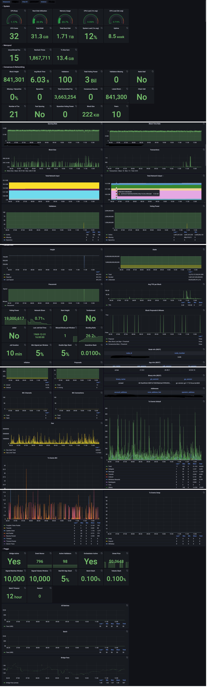

# Cendermint
    
Prometheus Exporter for Tendermint based blockchains.

## Disclaimer
This project started out as a fork of [Cosmos-IE](https://github.com/node-a-team/Cosmos-IE) by [Node A-Team](https://github.com/node-a-team). I'd like to express my greatest gratitude and appreciation to them for initiating and open-sourcing their awesome work. Since the fork it has undergone a few significant rewrites, refactors and design changes. Though semi-stable, Cendermint is still very much a work-in-progress so please proceed with caution.

## Architecture


## Supported chains
- Cosmos(`cosmoshub-4`)
- NYM (`testnet-milhon`)
- Umme (`umeevengers-1c`)
- Osmosis (`osmosis-1`)
- Juno (`juno-1`)
- Akash (`akashnet-2`)
- Regen (`regen-1`)
- Microtick (`microtick-1`)
- EVMOS (`evmos_9000-2`)

## Get Up and Running

### Build from Source
```bash
$ cd $GOPATH/src/githb.com
$ git clone https://github.com/jim380/Cendermint.git
$ cd $HOME/Cendermint
$ go build
# Important!!! Remember to fill out config.env
$ ./Cendermint run
```

### Docker
```bash
$ docker run --name cendermint -dt --restart on-failure -v <your_dir>:/root --net="host" --env-file ./config.env ghcr.io/jim380/cendermint:master /bin/sh -c "Cendermint run"
```
Again, remember to create a `config.env` under `<your_dir>` and have it filled out.

## Available metrics
| Name | Type | Tags | Description |
|------|------|------|-------------|
| `cendermint_chain_blockHeight` | Gauge | - | Current blockchain height|
| `cendermint_chain_block_interval` | Gauge | - | Interval between blocks|
| `cendermint_staking_bonded_ratio` | Gauge | - | Bonded stake ratio in the network |
| `cendermint_staking_bonded_tokens` | Gauge | - | Bonded stake amount in the network |
| `cendermint_staking_not_bonded_tokens` | Gauge | - | Unbonded stake amount in the network |
| `cendermint_staking_total_supply` | Gauge | - | Total token supply in the network |
| `cendermint_slashing_downtime_jail_duration` | Gauge | - | Downtime duration before getting jailed|
| `cendermint_slashing_min_signed_per_window` | Gauge | - | Minimum number of blocks that need to be signed per signing window before getting jailed |
| `cendermint_slashing_signed_blocks_window` | Gauge | - | Number of blocks in a signing window |
| `cendermint_slashing_slash_fraction_double_sign` | Gauge | - | % of stake to be slashed in the event of a double sign |
| `cendermint_slashing_slash_fraction_downtime` | Gauge | - | % of stake to be slashed in the event of downtime  |
| `cendermint_slashing_start_Height` | Gauge | - | The first block the validator signed on the current chain |
| `cendermint_slashing_index_offset` | Gauge | - | The index used to check if the validator has crossed below the liveness threshold over a sliding window |
| `cendermint_slashing_jailed_until` | Gauge | - | Most recent `jailed_until` date/time of the validator recorded on chain |
| `cendermint_slashing_tombstoned` | Gauge | - | Whether the validator is tombstoned (i.e. double sign) [0] False - [1] True |
| `cendermint_slashing_missed_blocks_counter` | Gauge | - | Total number of blocks the validator missed since last unjail |
| `cendermint_minting_actual_inflation` | Gauge | - | Actual inflation in the network |
| `cendermint_minting_inflation` | Gauge | - | Default inflation in the network |
| `cendermint_gov_total_proposal_count` | Gauge | - | Total number of proposals ever submitted in the network |
| `cendermint_gov_voting_proposal_count` | Gauge | - | Number of proposals currently in voting |
| `cendermint_validator_voting_power` | Gauge | - | Voting power of the validator |
| `cendermint_validator_min_self_delegation` | Gauge | - | Minimum self delegation amount of the validator |
| `cendermint_validator_jail_status` | Gauge | - | Jail status of the validator<br>[0] Active - [1] Jailed |
| `cendermint_validator_delegation_shares` | Gauge | - | Total number of delegated tokens of the validator |
| `cendermint_validator_delegation_ratio` | Gauge | - | Ratio of the validator's bonded stake to the network's total bonded stake |
| `cendermint_validator_commission_rate` | Gauge | - | Commission rate of the validator |
| `cendermint_validator_commission_max_rate` | Gauge | - | Maximum commission rate of the validator |
| `cendermint_validator_commission_max_change_rate` | Gauge | - | Maximum change rate of the validator's commission |
| `cendermint_validator_balances_uatom` | Gauge | - | Available balance of the validator |
| `cendermint_validator_commission_uatom` | Gauge | - | Available commission of the validator |
| `cendermint_validator_rewards_uatom` | Gauge | - | Available self-delegation rewards of the validator |
| `cendermint_validator_precommit_status` | Gauge | - | Precommit status of the validator<br>[0] Missed - [1] Signed |
| `cendermint_validator_proposer_status` | Gauge | - | Proposer status of the validator<br>[0] Not the proposer - [1] Proposer |
| `cendermint_validator_last_signed_height` | Gauge | - | The last height the validator signed |
| `cendermint_validator_miss_count` | Gauge | - | Number of blocks missed since the validator last signed |
| `cendermint_validator_miss_consecutive` | Gauge | - | The validator has missed two blocks in a row |
| `cendermint_validator_miss_threshold` | Gauge | - | The validator has missed `>= threshold` block since s/he last signed |
| `cendermint_upgrade_planned` | Gauge | - | If there is a chain upgrade planned |
| `cendermint_ibc_channels_total` | Gauge | - | Total number of ibc channels in the network |
| `cendermint_ibc_channels_open` | Gauge | - | Total number of open ibc channels in the network |
| `cendermint_ibc_connections_total` | Gauge | - | Total number of ibc connections in the network |
| `cendermint_ibc_connections_open` | Gauge | - | Total number of open ibc connections in the network |
| `cendermint_labels_node_info` | Counter | - | The following labels are currently avaialble: `app_name`; `binary_name`; `chain_id`; `git_commit`; `go_version`; `node_id`; `node_moniker`; `sdk_version`; `tm_version` |
| `cendermint_labels_addr` | Counter | - | The following labels are currently avaialble: `account_address`;`cons_address_hex`; `operator_address` |
| `cendermint_labels_upgrade` | Counter | - | The following labels are currently avaialble: `upgrade_name`, `upgrade_time`, `upgrade_height`, `upgrade_info` |
| `cendermint_tx_tps` | Gauge | - | Transactions processed per second per block |
| `cendermint_tx_gas_wanted_total` | Gauge | - | Total gas wanted in a block |
| `cendermint_tx_gas_used_total` | Gauge | - | Total gas used in a block |
| `cendermint_tx_events_total` | Gauge | - | Total tx events in a block |
| `cendermint_tx_delegate_total` | Gauge | - | Total delegate events in a block |
| `cendermint_tx_message_total` | Gauge | - | Total message events in a block |
| `cendermint_tx_transfer_total` | Gauge | - | Total transfer events in a block |
| `cendermint_tx_unbond_total` | Gauge | - | Total unbond events in a block |
| `cendermint_tx_withdraw_rewards_total` | Gauge | - | Total withdraw rewards events in a block |
| `cendermint_tx_create_validator_total` | Gauge | - | Total create validator events in a block |
| `cendermint_tx_redelegate_total` | Gauge | - | Total redelegate events in a block |
| `cendermint_tx_proposal_vote_total` | Gauge | - | Total vote events in a block |
| `cendermint_tx_ibc_fungible_token_packet_total` | Gauge | - | Total fungile token packet events in a block |
| `cendermint_tx_ibc_transfer_total` | Gauge | - | Total ibc transfer events in a block |
| `cendermint_tx_ibc_update_client_total` | Gauge | - | Total update client events in a block |
| `cendermint_tx_ibc_ack_packet_total` | Gauge | - | Total acknowledge packet events in a block |
| `cendermint_tx_ibc_send_packet_total` | Gauge | - | Total send packet events in a block |
| `cendermint_tx_ibc_recv_packet_total` | Gauge | - | Total receive packet events in a block |
| `cendermint_tx_ibc_timeout_total` | Gauge | - | Total timeout events in a block |
| `cendermint_tx_ibc__timeout_packet_total` | Gauge | - | Total timeout packet events in a block |
| `cendermint_tx_ibc_denom_trace_total` | Gauge | - | Total denomination trace events in a block |
| `cendermint_tx_swap_swap_within_batch_total` | Gauge | - | Total swap within batch events in a block |
| `cendermint_tx_swap_withdraw_within_batch_total` | Gauge | - | Total withdraw within batch events in a block |
| `cendermint_tx_swap_deposit_within_batch_total` | Gauge | - | Total deposit within batch events in a block |
| `cendermint_tx_others_total` | Gauge | - | Total number of events yet to be supported by Cendermint in a block |
| `cendermint_gravity_signed_valsets_window` | Gauge | - | Number of blocks per signing window for the validator set  |
| `cendermint_gravity_signed_batches_window` | Gauge | - | Number of blocks per signing window for a batch |
| `cendermint_gravity_target_batch_timeout` | Gauge | - | Target timeout period for a batch |
| `cendermint_gravity_slash_fraction_valset` | Gauge | - | The fraction of stake to be slashed if the total number of failed validator set relays in any signing window exceeds a set limit  |
| `cendermint_gravity_slash_fraction_batch` | Gauge | - | The fraction of stake to be slashed if the total number of failed batch relays in any signing window exceeds a set limit |
| `cendermint_gravity_slash_fraction_bad_eth_sig` | Gauge | - | The fraction of stake to be slashed if the total number of bad eth signatures in any signing window exceeds a set limit |
| `cendermint_gravity_valset_reward_amount` | Gauge | - | The total amount of bridge rewards for the validator set |
| `cendermint_gravity_bridge_active` | Gauge | - | If the gravity bridge is active or not |
| `cendermint_gravity_valset_count` | Gauge | - | The total number of validators at the current height in the bridge |
| `cendermint_gravity_valset_active` | Gauge | - | The active status of the orchestrator run by the desired validator |
| `cendermint_gravity_event_nonce` | Gauge | - | The latest event nonce witnessed by the orchestrator |
| `cendermint_gravity_erc20_price` | Gauge | - | Price of the ERC20 token |
| `cendermint_gravity_batch_fees` | Gauge | - | Total fees in the latest batch processed |
| `cendermint_gravity_batches_fees` | Gauge | - | Total fees in all batches (default 100 batches per bundle, 100 txs per batch) |
| `cendermint_gravity_bridge_fees` | Gauge | - | Bridge fees calculated in real time based on the prices of ETH and the ERC20 token |