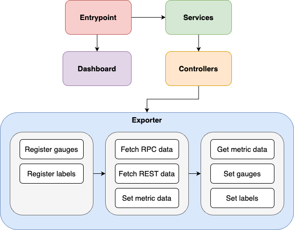
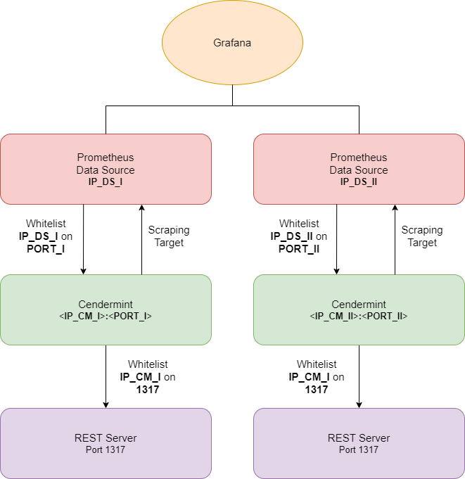
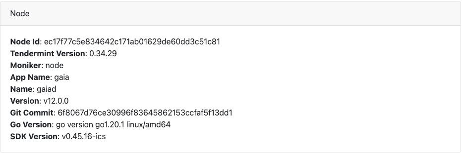
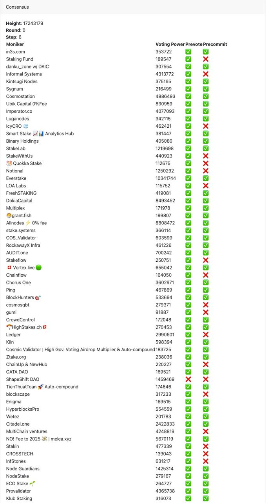

# Cendermint

  

A sophisticated Prometheus Exporter designed specifically for Cosmos SDK chains. It comes with an optional lightweight dashboard, providing a user-friendly interface for real-time data visualization and monitoring. This powerful tool is an essential asset for any developer working with Cosmos SDK chains, offering a seamless integration with Prometheus and enhancing the overall development experience.

## Disclaimer

Cendermint originated as a derivative of the [Cosmos-IE](https://github.com/node-a-team/Cosmos-IE) project by [Node A-Team](https://github.com/node-a-team). We extend our profound gratitude and appreciation to the Node A-Team for their pioneering efforts and their generosity in making their remarkable work open-source.

Since its inception, Cendermint has undergone numerous substantial revisions, refactoring, and design transformations. While it has achieved a degree of stability, it is important to note that Cendermint remains in an active development phase. We encourage users to exercise discretion while utilizing this evolving software.

## Architecture

<details>

<summary>Design</summary>



</details>

<details>

<summary>Infrastructure</summary>



</details>

## Dashbord

### Grafana

<details close>

<summary>General</summary>


</details>

<details close>

<summary>Signing Status</summary>

https://user-images.githubusercontent.com/31609693/200193555-2e5f6bc4-ecf4-4332-9999-a8db61b4fcda.mov

</details>

### Local

<details>

<summary>Missing Validators per Block</summary>

https://github.com/jim380/Cendermint/assets/31609693/1df264df-9c54-4a60-b3f0-5c9d0e98aa3c

</details>

<details>

<summary>Node Info</summary>



</details>

<details>

<summary>Consensus</summary>



</details>

## Supported chains

See [`chains.json`](/chains.json) .

</details>

## Get Up and Running

### Build from Source

```bash
$ cd $GOPATH/src/githb.com
$ git clone https://github.com/jim380/Cendermint.git
$ cd $HOME/Cendermint
$ go build
# Important!!! Remember to fill out config.env
$ ./Cendermint run
```

### Docker

#### Local Dev

```bash
$ DOCKER_BUILDKIT=1 docker compose build cendermint --no-cache
$ docker compose up -d
$ docker-compose down
```

#### Deploy

```bash
$ docker run --name cendermint -dt --restart on-failure -v <your_dir>:/root --net="host" --env-file ./config.env ghcr.io/jim380/cendermint:<tag> Cendermint run && docker logs cendermint -f --since 1m
```

Again, remember to create a `config.env` under `<your_dir>` and have it filled out.

## Available metrics

<details>

<summary>Default</summary>

| Name                                                | Type    |
| --------------------------------------------------- | ------- |
| `cendermint_chain_blockHeight`                      | Gauge   |
| `cendermint_chain_block_interval`                   | Gauge   |
| `cendermint_staking_bonded_ratio`                   | Gauge   |
| `cendermint_staking_bonded_tokens`                  | Gauge   |
| `cendermint_staking_not_bonded_tokens`              | Gauge   |
| `cendermint_staking_total_supply`                   | Gauge   |
| `cendermint_slashing_downtime_jail_duration`        | Gauge   |
| `cendermint_slashing_min_signed_per_window`         | Gauge   |
| `cendermint_slashing_signed_blocks_window`          | Gauge   |
| `cendermint_slashing_slash_fraction_double_sign`    | Gauge   |
| `cendermint_slashing_slash_fraction_downtime`       | Gauge   |
| `cendermint_slashing_start_Height`                  | Gauge   |
| `cendermint_slashing_index_offset`                  | Gauge   |
| `cendermint_slashing_jailed_until`                  | Gauge   |
| `cendermint_slashing_tombstoned`                    | Gauge   |
| `cendermint_slashing_missed_blocks_counter`         | Gauge   |
| `cendermint_minting_actual_inflation`               | Gauge   |
| `cendermint_minting_inflation`                      | Gauge   |
| `cendermint_gov_total_proposal_count`               | Gauge   |
| `cendermint_gov_voting_proposal_count`              | Gauge   |
| `cendermint_gov_voting_proposal_voted_count`        | Gauge   |
| `cendermint_gov_voting_proposal_did_not_vote_count` | Gauge   |
| `cendermint_validator_voting_power`                 | Gauge   |
| `cendermint_validator_min_self_delegation`          | Gauge   |
| `cendermint_validator_jail_status`                  | Gauge   |
| `cendermint_validator_delegation_shares`            | Gauge   |
| `cendermint_validator_delegation_ratio`             | Gauge   |
| `cendermint_validator_commission_rate`              | Gauge   |
| `cendermint_validator_commission_max_rate`          | Gauge   |
| `cendermint_validator_commission_max_change_rate`   | Gauge   |
| `cendermint_validator_precommit_status`             | Gauge   |
| `cendermint_validator_proposer_status`              | Gauge   |
| `cendermint_validator_last_signed_height`           | Gauge   |
| `cendermint_validator_miss_count`                   | Gauge   |
| `cendermint_validator_miss_consecutive`             | Gauge   |
| `cendermint_validator_miss_threshold`               | Gauge   |
| `cendermint_upgrade_planned`                        | Gauge   |
| `cendermint_ibc_channels_total`                     | Gauge   |
| `cendermint_ibc_channels_open`                      | Gauge   |
| `cendermint_ibc_connections_total`                  | Gauge   |
| `cendermint_ibc_connections_open`                   | Gauge   |
| `cendermint_labels_node_info`                       | Counter |
| `cendermint_labels_addr`                            | Counter |
| `cendermint_labels_upgrade`                         | Counter |
| `cendermint_tx_tps`                                 | Gauge   |
| `cendermint_tx_gas_wanted_total`                    | Gauge   |
| `cendermint_tx_gas_used_total`                      | Gauge   |
| `cendermint_tx_events_total`                        | Gauge   |
| `cendermint_tx_delegate_total`                      | Gauge   |
| `cendermint_tx_message_total`                       | Gauge   |
| `cendermint_tx_transfer_total`                      | Gauge   |
| `cendermint_tx_unbond_total`                        | Gauge   |
| `cendermint_tx_withdraw_rewards_total`              | Gauge   |
| `cendermint_tx_create_validator_total`              | Gauge   |
| `cendermint_tx_redelegate_total`                    | Gauge   |
| `cendermint_tx_proposal_vote_total`                 | Gauge   |
| `cendermint_tx_ibc_fungible_token_packet_total`     | Gauge   |
| `cendermint_tx_ibc_transfer_total`                  | Gauge   |
| `cendermint_tx_ibc_update_client_total`             | Gauge   |
| `cendermint_tx_ibc_ack_packet_total`                | Gauge   |
| `cendermint_tx_ibc_send_packet_total`               | Gauge   |
| `cendermint_tx_ibc_recv_packet_total`               | Gauge   |
| `cendermint_tx_ibc_timeout_total`                   | Gauge   |
| `cendermint_tx_ibc__timeout_packet_total`           | Gauge   |
| `cendermint_tx_ibc_denom_trace_total`               | Gauge   |
| `cendermint_tx_swap_swap_within_batch_total`        | Gauge   |
| `cendermint_tx_swap_withdraw_within_batch_total`    | Gauge   |
| `cendermint_tx_swap_deposit_within_batch_total`     | Gauge   |
| `cendermint_tx_others_total`                        | Gauge   |

</details>

<details>

<summary>Gravity Bridge</summary>

| Name                                            | Type  |
| ----------------------------------------------- | ----- |
| `cendermint_gravity_signed_valsets_window`      | Gauge |
| `cendermint_gravity_signed_batches_window`      | Gauge |
| `cendermint_gravity_target_batch_timeout`       | Gauge |
| `cendermint_gravity_slash_fraction_valset`      | Gauge |
| `cendermint_gravity_slash_fraction_batch`       | Gauge |
| `cendermint_gravity_slash_fraction_bad_eth_sig` | Gauge |
| `cendermint_gravity_valset_reward_amount`       | Gauge |
| `cendermint_gravity_bridge_active`              | Gauge |
| `cendermint_gravity_valset_count`               | Gauge |
| `cendermint_gravity_valset_active`              | Gauge |
| `cendermint_gravity_event_nonce`                | Gauge |
| `cendermint_gravity_erc20_price`                | Gauge |
| `cendermint_gravity_batch_fees`                 | Gauge |
| `cendermint_gravity_batches_fees`               | Gauge |
| `cendermint_gravity_bridge_fees`                | Gauge |

</details>

<details>

<summary>Akash</summary>

| Name                                  | Type  |
| ------------------------------------- | ----- |
| `cendermint_akash_total_deployments`  | Gauge |
| `cendermint_akash_active_deployments` | Gauge |
| `cendermint_akash_closed_deployments` | Gauge |

</details>

<details>

<summary>Oracle</summary>

| Name                                                | Type  |
| --------------------------------------------------- | ----- |
| `cendermint_oracle_validator_missed_blocks_counter` | Gauge |
| `cendermint_oracle_validator_prevote_submit_height` | Gauge |
| `cendermint_oracle_validator_vote_module_votes`     | Gauge |

</details>
